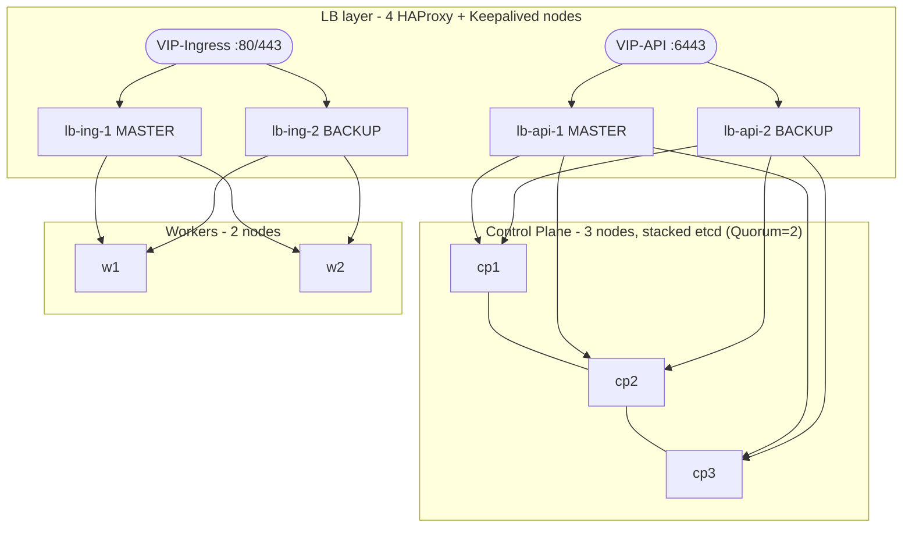

# Utravs Event-Driven Platform - Senior DevOps Technical Assignment

Design and implementation of an **Event-Driven** platform on **Kubernetes** with **high availability** on an On-Premise style infrastructure:
`Ansible (IaC)` • `kubeadm` (stacked etcd) • `HAProxy/Keepalived` • `GitOps (ArgoCD + Helm)` • `Istio mTLS` • `Vault HA` • `Prometheus + Alertmanager` • `OpenTelemetry + Jaeger` • `resilience testing`

---

## 1. High-Level Architecture



**Traffic paths:**
- `kubectl` → VIP-API → HAProxy (API pair) with `/healthz` Health-Check → healthy Control Plane → stacked etcd (local TLS)
- Browser / client → VIP-Ingress → HAProxy (Ingress pair) → ingress-nginx NodePorts on Workers → services

**Components running on Workers:** Kafka ×3 (Strimzi) • Vault ×3 (Raft) • Istio • ArgoCD • Prometheus + Alertmanager + Grafana • Jaeger + OTel Collector • Producer/Consumer

---

## 2. Prerequisites

| Item | Details |
|---|---|
| Servers | 9 VPS instances, identical location and OS - see [VERSIONS.md](VERSIONS.md) |
| Operator host | Linux or **WSL2** on Windows with `ansible-core >= 2.17` and `ssh` |
| Git | A **private GitHub repository** for GitOps |
| Access | SSH (root or sudo) on all 9 servers |

---

## 3. Repository Layout

```
ansible/            IaC - playbooks and Idempotent roles
  inventory/        9 servers + groups (lb_api, lb_ingress, control_plane, workers)
  playbooks/        site.yml - run the whole chain with one command
  roles/            common, containerd, haproxy_keepalived, kubeadm_control_plane, kubeadm_worker
gitops/             ArgoCD bootstrap + Applications + environments (dev/prod)
charts/             Helm charts for the sample services
apps/               Producer/Consumer sources with OpenTelemetry
scripts/            failover test scripts and evidence collectors
docs/               architecture, reliability report, trade-offs, runbooks, evidence
```

---
> [!NOTE]
> **Infrastructure Limitation**
>
> Due to limitations of the VPS provider regarding Floating IP support, the load balancers cannot be configured with a dedicated Virtual IP (VIP) in the current implementation.
>
> However, Virtual IPs have been considered in the architecture and can be implemented in an environment where Floating IPs or equivalent network capabilities are available.

## 4. Setup Steps (from a clean environment)

### Step 0 - Prepare the operator host (your own machine)

```bash
# inside Linux
sudo apt update && sudo apt install -y python3-pip openssh-client git
pip3 install "ansible-core>=2.17"
ansible-galaxy collection install -r ansible/collections/requirements.yml
ansible --version && git --version
```

### Step 1 - Fill in the Inventory
set the NIC name (`vrrp_interface`), `api_vip` and `ingress_vip` in
`ansible/inventory/group_vars/all.yml`, and put VRRP passwords into `vault.yml` (Ansible Vault).

### Step 2 - Run the IaC (whole chain with one command)

```bash
cd ansible
ansible-playbook -i inventory/hosts.yml playbooks/site.yml
```

Execution order (selectable via tags):

| Stage | Tag | Description |
|---|---|---|
| 1 | `common` | sysctl, swap, time sync, base hardening - on all 9 nodes |
| 2 | `lb` | 4 × HAProxy + 2 Keepalived pairs + Health-Checks |
| 3 | `runtime` | containerd + runc on Control Plane and Workers |
| 4 | `k8s_cp` | `kubeadm init` (stacked etcd) + join of cp2/cp3 + Cilium |
| 5 | `k8s_worker` | join Workers |

Re-running any stage is **Idempotent** and must not produce errors.

### Step 3 - Access the cluster

```bash
scp root@<cp1>:/etc/kubernetes/admin.conf ~/.kube/config   # server is the VIP
kubectl get nodes
```

### Steps 4 to 8 - GitOps, services, security, observability, failover tests

#### Step 4 - Bootstrap ArgoCD

```bash

# one-time cluster bootstrap (installs ArgoCD + applies the root Application)
GIT_REPO=https://github.com/<user>/utravs-devops-task.git gitops/argocd/bootstrap/install-argocd.sh
```

ArgoCD then discovers every Application under `gitops/argocd/applications/`
and keeps them in sync (order enforced by sync-waves:
storage → monitoring → istio → platform → kafka → alerts → services).

#### Step 5 - build and push the application images

```bash
GITHUB_OWNER=<user> ./scripts/build-push-images.sh 1.0.0
# set image.repository to ghcr.io/<user> in charts/*/values.yaml
# and in gitops/environments/*/*-values.yaml, then push
```

#### Step 6 - Vault bootstrap (Kubernetes auth, roles, initial secrets)

```bash
./scripts/setup-vault.sh     # init + unseal + kv engine + k8s auth + roles
```

#### Step 7 - verify platform health

```bash
kubectl get applications.argoproj.io -n argocd      # all Synced/Healthy
kubectl get pods -A                                 # all Running
kubectl -n monitoring get prometheusrule            # 3 critical alerts present
kubectl get ingress -A                              # 6 UI ingresses (grafana/prometheus/alertmanager/jaeger/argocd/vault)
# produce a few messages, then open Jaeger UI and find an end-to-end trace
kubectl -n observability port-forward svc/jaeger-query 16686:16686
```

All web consoles are also published through the ingress controller
(manifests in `gitops/components/ui-ingress/`, synced by the ArgoCD
Application `ui-ingress`) - HTTPS everywhere, one wildcard certificate:

| Console | URL |
|---|---|
| Grafana | `https://grafana.unit5chd.qzz.io` |
| Prometheus | `https://prometheus.unit5chd.qzz.io` |
| Alertmanager | `https://alertmanager.unit5chd.qzz.io` |
| Jaeger | `https://jaeger.unit5chd.qzz.io` |
| ArgoCD | `https://argocd.unit5chd.qzz.io` |
| Vault | `https://vault.unit5chd.qzz.io` |


#### Step 8 - failover tests, secret rotation and evidence

```bash
./scripts/test-k8s-api-failover.sh        # VIP/CP failover + recovery time
./scripts/test-kafka-leader-failover.sh   # leader election + continued processing
./scripts/test-vault-failover.sh          # raft step-down + secret availability
./scripts/rotate-secret.sh producer       # runtime secret rotation
./scripts/collect-evidence.sh             # snapshot into docs/evidence/
# fill the measured times into docs/reliability-report.md
```

---

## 5. Failover Tests (evidence under `docs/evidence/`)

| # | Scenario | Expected behaviour |
|---|---|---|
| 1 | Kill MASTER of the API LB pair | VIP moves to BACKUP in seconds, `kubectl` keeps working |
| 2 | Kill one Control Plane node | API stays available via the remaining nodes |
| 3 | Kill the Kafka leader broker | New leader elected, message processing continues |
| 4 | Kill the active Vault node | Failover without losing service access to secrets |
| 5 | Kill MASTER of the Ingress LB pair | Ingress traffic moves to BACKUP without interruption |

> Full report: [docs/reliability-report.md](docs/reliability-report.md) | Trade-offs: [docs/tradeoffs.md](docs/tradeoffs.md)

---

## 6. Further Documentation

- [VERSIONS.md](VERSIONS.md) - exact tool versions and server resources
- [docs/architecture.md](docs/architecture.md) - full architecture diagrams
- [docs/reliability-report.md](docs/reliability-report.md) - test results and recovery times
- [docs/tradeoffs.md](docs/tradeoffs.md) - architecture decisions vs. production
