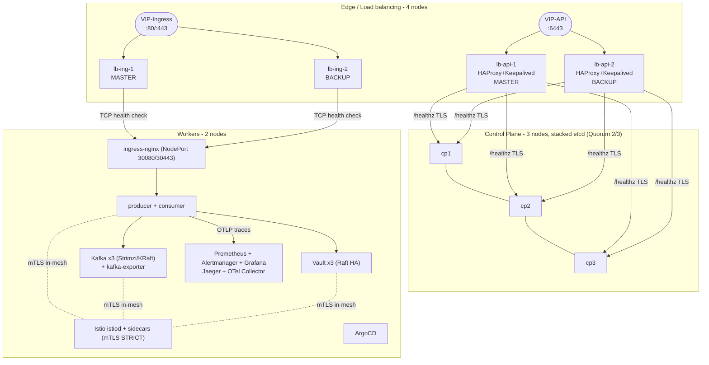
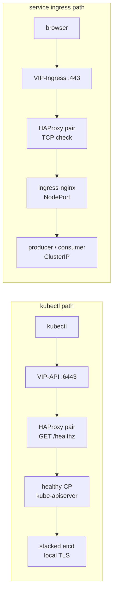
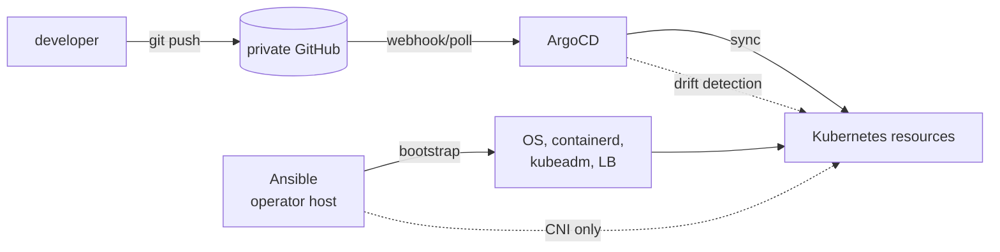
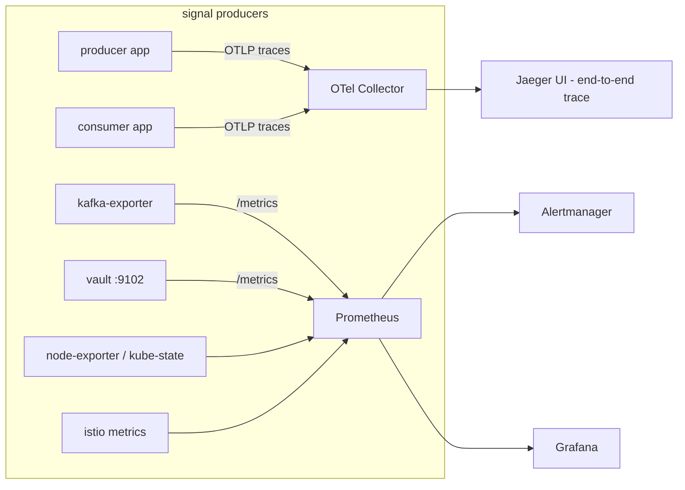

# Architecture

Event-driven platform on Kubernetes with high availability, deployed entirely
as code (Ansible for the infrastructure, ArgoCD/GitOps for everything inside
the cluster).

## 1. Global view (9 nodes)

## 2. Traffic paths

## 3. Delivery pipeline (GitOps)

- **Bootstrap (one-time, scripted):** `ansible/playbooks/site.yml` →
  `gitops/argocd/bootstrap/install-argocd.sh` → `scripts/setup-vault.sh`
- **Steady state:** every change goes through Git; ArgoCD reconciles and prunes
  drift. Manual `kubectl apply` is never part of the normal path.

## 4. Security architecture

| Layer | Mechanism |
|---|---|
| East-west traffic | Istio **mTLS STRICT** (mesh-wide `PeerAuthentication`) |
| Ingress edge | ingress-nginx stays **outside** the mesh (it must take plain HTTP from HAProxy/VIP clients and addresses backends by pod IP with the original Host), so the four ingress-exposed workloads carry a workload-scoped **PERMISSIVE** `PeerAuthentication` (`allow-ingress-plaintext-{jaeger,producer,consumer,vault}`) - everything else, and all meshed-to-meshed traffic, stays STRICT |
| Secrets | HashiCorp **Vault (3-node Raft HA)** + Kubernetes auth, short TTL (1h) roles |
| Secret delivery | Vault **Agent sidecar injection** - secrets exist only at runtime (`/vault/secrets/...`) |
| Git hygiene | No secret in Git/Helm values/ConfigMaps (enforced by `.gitignore` + review) |
| Rotation | `scripts/rotate-secret.sh` - new value without redeploying |
| Edge | HAProxy with TLS health checks; API certificate SANs include the VIP |
| Workload | non-root securityContext, dropped capabilities, resource limits |

## 5. Observability architecture

**Required critical alerts** (in `gitops/components/monitoring/prometheus-rules.yaml`):

1. `KafkaConsumerLagCritical` - consumer lag > 10000 for 5m
2. `VaultSealedCritical` - `vault_core_unsealed == 0` for 2m
3. `IstioMeshHighErrorRate` - mesh 5xx rate > 5% for 5m

Bonus: `IstiodDown`, `KafkaBrokerDown`, `KubeApiServerHighErrorRate`,
`IstioPodWithoutSidecarTraffic` (mTLS bypass detection).

## 6. Message path semantics

- **Delivery: at-least-once.** Producer: `acks=all` + idempotent producer +
  retries. Consumer: `enable.auto.commit=false`, offset committed **after**
  processing, and an idempotency buffer ignores redelivered ids.
- Traces travel in Kafka headers → one end-to-end trace across services.
